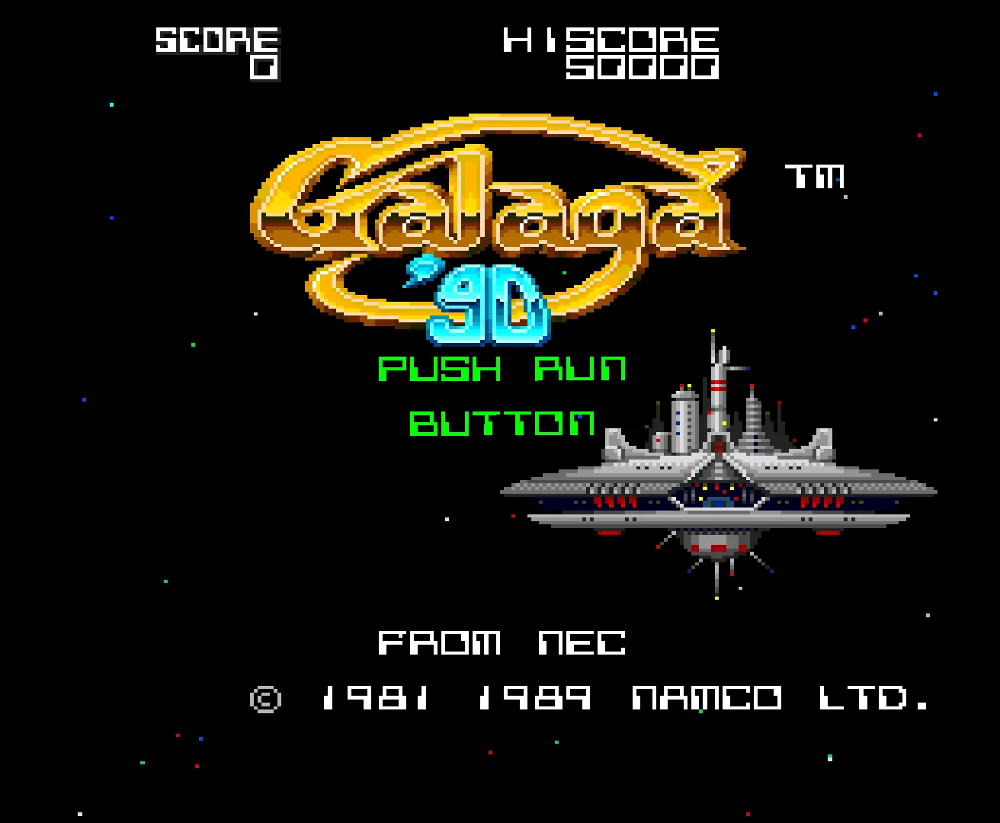

# galaga-webb
<!DOCTYPE html>
<html lang="es">
<head>
  <meta charset="UTF-8">
  <title>Galaga 90'</title>
  
</head>
<body>

  <h1>Galaga 90'</h1>

  

    Galaga '90 is a shoot 'em up video game released by Namco in 1989 for the PC Engine (TurboGrafx-16). 
    It is an enhanced version of the classic <em>Galaga</em> (1981), where the player controls a spaceship 
    that must destroy waves of alien enemies in formations and attack patterns. The game stands out for its 
    colorful graphics, arcade music, branching levels, bonus stages, and the ability to form a double ship by 
    rescuing a captured one. Its simple yet addictive gameplay made it one of the best installments in the series.
  

  

    This remake of the game was created by Aidan Albero, Montserrat Medina, and Luana Alemán.
  

  <!-- Imagen del juego -->
  

  <!-- Tabla de contribuciones -->
  <table>
    <tr>
      <th>Team Member</th>
      <th>Task</th>
      <th>Time (hours)</th>
    </tr>
    <tr><td>Luana Alemán Armelin</td><td>Home Screen</td><td>4h</td></tr>
    <tr><td>Luana Alemán Armelin</td><td>Project Structure</td><td>6h</td></tr>
    <tr><td>Luana Alemán Armelin</td><td>One Enemy</td><td>3h</td></tr>
    <tr><td>Aidan Albero García</td><td>Sounds</td><td>1h</td></tr>
    <tr><td>Aidan Albero García</td><td>Enemy bullet</td><td>2h</td></tr>
    <tr><td>Aidan Albero García</td><td>Game over</td><td>3h</td></tr>
    <tr><td>Aidan Albero García</td><td>Boss</td><td>5h</td></tr>
    <tr><td>Aidan Albero García</td><td>Invincibility</td><td>1h</td></tr>
    <tr><td>Montserrat Medina Chavez</td><td>Win Screen/Credits Screen</td><td>2h</td></tr>
    <tr><td>Montserrat Medina Chavez</td><td>Two Enemies</td><td>6h</td></tr>
    <tr><td>Montserrat Medina Chavez</td><td>Level 2</td><td>1h</td></tr>
  </table>

  <!-- Miniatura del video -->

    Click on the image to watch the video
  

  <!-- Enlace a GitHub -->
  

    <a class="button" href="https://github.com/noname117-bot/Galaga-88.git" target="_blank">Ver el código en GitHub</a>
  

</body>
</html>
 
